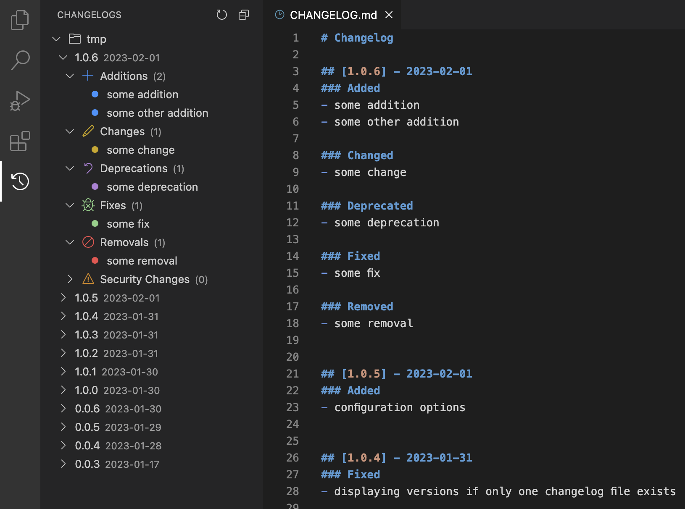

# Simple Changelog

*Work in Progress*

<!-- project badges -->

## ToDo
- [x] open changelog file
- [x] add version
- [x] edit version
- [x] delete version
- [x] add item
- [x] edit item
- [x] delete item

## Configuration

*All keys starting with `simpleChangelog.`*

| Settings key               | Type                            | Default Value     | Description                                                                                                          |
| -------------------------- | ------------------------------- | ----------------- | -------------------------------------------------------------------------------------------------------------------- |
| icons.color.enabled        | boolean                         | `true`            | Enable/disable color on icons in changelog.                                                                          |
| icons.addition.icon        | string                          | `add`             | The icon for the `Additions` section.                                                                                |
| icons.addition.color       | string                          | `charts.blue`     | The color of the `Additions` icon.                                                                                   |
| icons.change.icon          | string                          | `edit`            | The icon for the `Changes` section.                                                                                  |
| icons.change.color         | string                          | `charts.yellow`   | The color of the `Changes` icon.                                                                                     |
| icons.deprecation.icon     | string                          | `discard`         | The icon for the `Deprecations` section.                                                                             |
| icons.deprecation.color    | string                          | `charts.purple`   | The color of the `Deprecations` icon.                                                                                |
| icons.fix.icon             | string                          | `debug`           | The icon for the `Fixes` section.                                                                                    |
| icons.fix.color            | string                          | `charts.green`    | The color of the `Fixes` icon.                                                                                       |
| icons.removal.icon         | string                          | `circle-slash`    | The icon for the `Removals` section.                                                                                 |
| icons.removal.color        | string                          | `charts.red`      | The color of the `Removals` icon.                                                                                    |
| icons.securityChange.icon  | string                          | `warning`         | The icon for the `Security Changes` section.                                                                         |
| icons.securityChange.color | string                          | `charts.orange`   | The color of the `Security Changes` icon.                                                                            |
| icons.item.icon            | string                          | `circle-filled`   | The icon for the changelog items.                                                                                    |
| icons.item.enabled         | boolean                         | `false`           | Enable/disable type icons on items.                                                                                  |
| groupsOpenByDefault        | boolean                         | `true`            | If set to `true`, groups are open by default when opening version.                                                   |
| searchIncludeRegex         | string                          | `/changelog.md/i` | The regex used to search workspace folders for changelog files.                                                      |
| searchExcludeRegex         | string                          | `/node_modules/`  | The regex used exlude folders in search for changelog files.                                                         |
| dateFormat                 | string                          | `YYYY-MM-DD`      | The date format. See [Moment.js Documentation](https://momentjs.com/docs/#/displaying/format/) for more information. |
| attribution.visibility     | `visible` \| `hidden` \| `none` | `visible`         | Choose how the attribution to the extension should be displayed.                                                     |
| attribution.placement      | `top` \| `bottom`               | `top`             | Choose where the attribution to the extension should be displayed.                                                   |

## Attributions
### Icons
- [Return icons created by Pixel perfect - Flaticon](https://www.flaticon.com/free-icons/return)